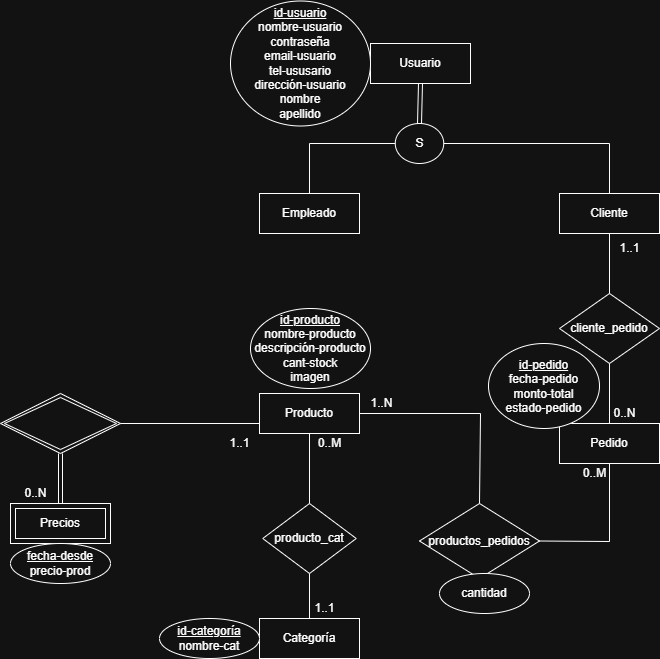

# Propuesta TP DSW

## Grupo

### Integrantes

- 51349 - Giannone María Belén
- 48846 - D´Alleva Berenice

### Repositorios

- [frontend app](https://github.com/Belen-Giannone/Frontend-dsw)
- [backend app](https://github.com/Bere167/DSW-backend)

## Tema

### Descripción

Se trata de un proyecto de E-commerce dedicada a la gestión de venta de productos de computación que contega un carrito de compras, funcionalidades de búsqueda con filtros y con una organización clara de los productos. Se permitirá realizar pedidos a los clientes y que los usuarios se registren.

### Modelo

_Nota_: incluir un link con la imagen de un modelo, puede ser modelo de dominio, diagrama de clases, DER. Si lo prefieren pueden utilizar diagramas con [Mermaid](https://mermaid.js.org) en lugar de imágenes.

## Alcance Funcional

### Alcance Mínimo

Regularidad:
|Req|Detalle|
|:-|:-|
|CRUD simple|1. CRUD Categoría 2. CRUD Usuario|
|CRUD dependiente|1. CRUD Producto {depende de} CRUD Categoría|
|Listado + detalle| 1. Listado de pedidos filtrado por rango de fecha, muestra id pedido,fecha de compra, nombre cliente y estado => detalle muestra datos completos del cliente y del pedido|
|CUU/Epic|1. Realizar la compra|

Aún no definimos para Aprobación Directa.
